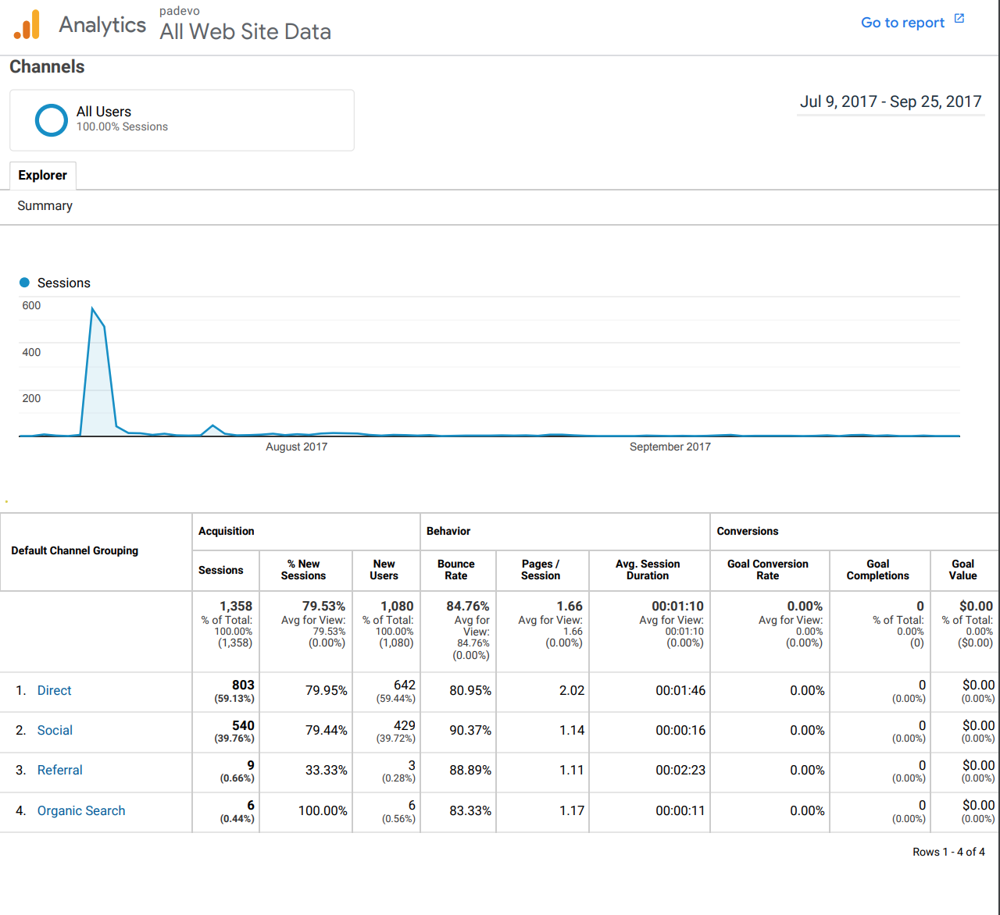

# padevo.info

### Update: No longer being worked on. 

A simple web application whose goal is to help "Puzzles and Dragons" players by quickly generating a list of materials requried to evole a monster.There's still a lot of work to be done, this is a simple prototype as of now... 

Everything is hosted on Digital Ocean using their Ubuntu servers and the code on this repository may not reflect everything as some information is private :). 

Thanks to the folks over at [PADherder](https://www.padherder.com/api/) for their public API, without them this wouldn't have been possible for me. Another thanks to the [/r/puzzlesanddragons folks](https://www.reddit.com/r/PuzzleAndDragons/comments/6nieud/misc_we_built_a_website_to_help_with_evolutions/) that checked out our website and provided feedback. 

